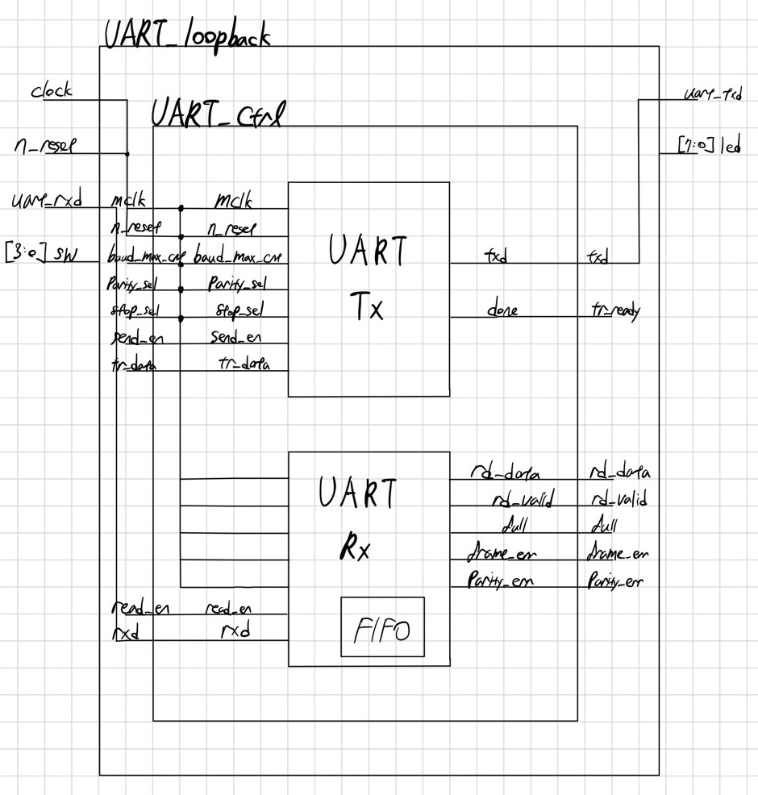
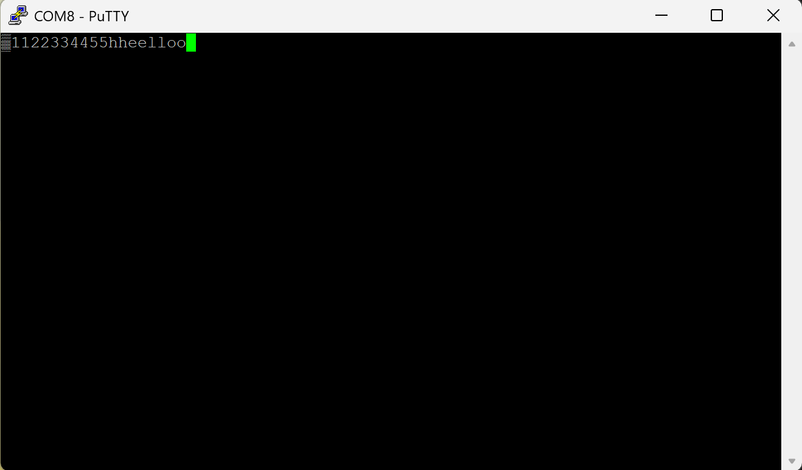

# UART_Loopback

This project implements a UART (Universal Asynchronous Receiver/Transmitter) on an FPGA to demonstrate loopback communication between a PC and the FPGA.

The data path of UART Loopbakc starts from PC(PuTTY) -> UART_Rx -> FIFO -> UART_Tx -> PC

## UART_Loopback Architecture

## Features
- External loopback (PC -> FPGA -> PC) operation
- Verified via simulation (ILA, VIO) and hardware

## Result

